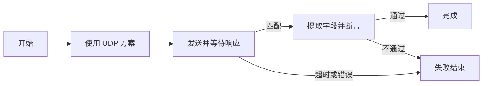

# PortBridge 可拖拽工作流与 HTTP/WebSocket 接入调研

状态：设计建议与独立适配验证，未接入正式程序。调研基于 `profile-picker-1` 源码及 Git 初始提交 `7e69eae`。用户希望自定义拖拽组合工作流，并要求后续 HTTP/WebSocket 使用优秀开源模块。本轮未改变产品源码、发布程序或现有会话行为。

## 1. 推荐方案

采用 **QtNodes 原生画布 + 独立工作流执行器 + 协议适配器**。用户通过拖入节点、设置参数、连接执行出口及保存子流程组合自动化；通信协议由开发者注册为内置节点，无需用户写程序。

| 层 | 推荐 | 依据 |
| --- | --- | --- |
| 拖拽编辑器 | QtNodes 3.0.16，BSD-3-Clause | Qt Widgets 原生模型/视图，提供节点、端口、连线、移动、样式和序列化接口；本机已编译并验证拖动。 |
| 工作流执行 | PortBridge 的异步执行器 | 明确控制执行顺序、超时、取消、循环、会话归属与有限缓冲。 |
| 现有串口/TCP/UDP | 现有 SessionController 的协议适配层 | 复用已有网络核心、字节编码和记录能力；增加可靠事件观察与发送追踪。 |
| HTTP/HTTPS 客户端 | cpr / libcurl，cpr 主体 MIT | 成熟 HTTP 实现及客户端封装，方法、头部、认证、超时和响应可组合。 |
| WebSocket 客户端 | Boost.Beast，BSL-1.0 | 基于 Boost.Asio 的原生异步 HTTP/1/WebSocket 实现，支持消息限额、完整消息读取和 TLS 组合。 |

HTTP 和 WebSocket 首轮按客户端规划。HTTP 服务端、WebSocket 服务端、多个同时运行的持久连接另行扩展；选择模块时保留扩展空间。

QtNodes 负责呈现和图编辑。使用 `AbstractGraphModel + BasicGraphicsScene` 表示业务执行图。它的 `DataFlowGraphModel` 会在输入、连线或源节点变化时自动传播并触发算法，不宜直接承载有网络副作用的操作。编辑、连线、打开和导入工作流应保持无业务发送，只有显式“运行”启动执行器。

## 2. 当前代码给出的接入边界

| 代码证据 | 对工作流的影响 |
| --- | --- |
| `include/portbridge/types.hpp`：TransportKind 只有 Serial/TcpClient/TcpServer/Udp；ConnectionConfig 没有稳定 ID | 连接方案引用不能依赖列表索引或名称；新协议需独立配置及能力定义。 |
| `include/portbridge/session_controller.hpp`：send 返回 bool，signals 只有状态/数据可用等聚合通知 | bool 表示接受请求；需要 requestId/完成通知，才能准确表示节点发送结果。 |
| `src/session/session_controller.cpp`：store 在显示前按暂停、抽样、记录数及字节预算省略数据 | “等待回复”必须观察独立的原始接收事件，不能使用 takeDisplayRecords、文本预览或表格。 |
| store 在记录队列满时对流数据返回 false，请求重试同一块 | 工作流事件需在此次数据真正被接受后发布一次，避免重复观察重试块。 |
| `src/ui/main_window.cpp`：浏览方案会把活动 controller 与模型停放，当前 c 可成为离线浏览 controller | 执行器应绑定稳定会话句柄，不能每个节点重新取当前页面选中的 c。 |
| startPeriodic 用 QTimer 调度且计数接受的请求 | 串行请求/响应循环由工作流执行器调度；避免套用周期计数作为成功次数。 |
| `src/session/configuration.cpp`：配置 schemaVersion=1，严格校验四类协议及字段 | 新协议与稳定 profileId 需要有版本的迁移；旧文件必须继续可读。 |
| `CMakeLists.txt`：Qt 6.8.3、C++17、MinGW，网络为 standalone Asio | Beast 的 Boost.Asio 与 standalone Asio 不是同一个类型，需隔离为独立适配器执行环境。 |

## 3. 编辑器方案比较

| 方案 | 优点 | 本项目成本与结论 |
| --- | --- | --- |
| QtNodes | 原生 Widgets；有模型/视图、图编辑及 JSON 接口；可改绘制 | 优先推荐；正式接入前复核本机发现的编译告警，并验证撤销、断线重连及复杂图保存。 |
| 自建 QGraphicsScene/QGraphicsView | 完全控制视觉和交互，依赖少 | 节点命中、端口拖线、撤销、选择、缩放及复制需自行实现；作为备选。 |
| React Flow | 自定义节点和交互生态成熟；MIT | 常见内嵌路线需要 WebEngine/WebChannel。Qt 官方明确 WebEngine 不能用 MinGW 编译；当前工具链不适合直接采用。外部 WebView2 是额外路线，需另做桥接和运行时部署。 |

QtNodes 的默认皮肤只是验证画面，正式界面应沿用当前深浅配色、字体、间距和清晰文字。兼容性验证截图不代表最终产品设计。

建议新增“工作流”主导航页面：左侧节点库，中间画布，右侧参数面板，底部运行日志。进入该页时收起工作台连接参数侧栏，为画布留出宽度；顶部显示绑定的运行资源和状态。小窗口可折叠节点库、参数区和日志区。

必需交互：拖入创建、拖动摆放、端口拖线、框选、多选、复制删除、撤销重做、缩放平移、适应画布、搜索节点、模板保存及导入导出。画布显示正在执行/等待/成功/失败状态，参数错误定位到具体节点和字段。运行时先锁定结构编辑，保留平移、缩放和状态查看。

## 4. HTTP/WebSocket 开源模块取舍

### HTTP：cpr/libcurl

[cpr](https://github.com/libcpr/cpr) 是 libcurl 的 C++ 客户端封装。检索时 GitHub latest release 为 **1.14.2**；正式引入应锁定 tag/commit，而不是追踪 master。当前源码要求 C++17，与项目一致。主许可证是 MIT，test 目录例外需保留其自己的许可，分发时包括 libcurl 及实际启用的依赖许可。

推荐用一个 `HttpAdapter` 包装。请求 DTO 表示 method、URL、headers、body、连接超时、总截止时间、响应上限和请求 ID；输出状态码、响应头、应用层 body、耗时及完成/错误状态。非 2xx 响应应可查看并由工作流断言判断，不能一律当作无响应。

不能直接在 GUI 或逐节点调用中无限创建异步任务。可以在 PortBridge 有界工作池中执行 cpr 请求，或使用 libcurl multi 构建受控异步实现。取消结合请求取消接口/回调、连接及总超时；DNS/TLS 等阶段的停止时延需要实际验证。不能假定停止按钮会立刻撤销已送达服务器的请求。

大响应通过接收回调检查限额，超限中止，不先把全部 body 累积到内存再裁剪。HTTP/2 能力取决于实际 libcurl 构建及服务端协商，不能仅凭 cpr 名称承诺。Windows TLS 可评估 WinSSL/Schannel 或 OpenSSL，固定实际构建配置并做 HTTPS 和部署验证。

### WebSocket：Boost.Beast

[Boost.Beast](https://github.com/boostorg/beast) 提供 HTTP/1 与 RFC 6455 WebSocket 的低层异步实现，许可证 BSL-1.0。对本项目的关键能力是 `async_read/async_write`、消息文本/二进制标识、控制帧处理及 `read_message_max`。

`WsAdapter` 管理 URL、握手头、子协议、TLS、连接状态、发送队列、完整消息、关闭码和关闭原因。消息上限在接收和装配过程中生效；发送同一连接的写操作串行化，读写生命周期由明确状态管理。心跳是协议控制行为，显示时与业务消息区分。

Beast 使用 **Boost.Asio**，当前 raw 网络核心使用 **standalone Asio**。首轮保持独立 io_context/执行线程，通过共享的协议接口和有限事件队列连接工作流。不要直接把 standalone 的 socket/io_context 传给 Beast。后续如要统一网络底层，应作为单独迁移，重新验证现有性能和生命周期。

WSS 需要匹配工具链的 TLS 依赖，优先验证 OpenSSL。Qt 验证程序能加载 SSL 后端，不代表 Beast/cpr 的 TLS 配置和便携包已经通过验证。

### 其他候选

| 项目 | 评价 |
| --- | --- |
| IXWebSocket | 易用客户端/服务端、有后台线程、TLS 和自动重连选项。项目 LICENSE 为 BSD-3-Clause，部分源文件保留 MIT 头，应保留各文件声明。本次公共 API/接收源码检查未找到直接可配置的完整消息大小上限；需要继续确认或增加限额适配。自动重连应按工作流策略显式控制。列为 WebSocket 备选。 |
| cpp-httplib | 当前 README **已经有 WebSocket 支持**，不能按旧资料说它只支持 HTTP。其 HTTP 为 blocking I/O，HTTP/1.1；WebSocket 按连接占线程并不支持扩展。当前 README 明确 MinGW/MSYS2 不受支持或测试，故不作当前工具链主选。许可证 MIT。 |
| Beast 同时负责 HTTP 和 WebSocket | 可统一到 Boost.Asio，依赖组合更集中；但 HTTP 重定向、认证、连接复用等高层客户端逻辑需自行整合。若首轮明确只需 HTTP/1.1，可进一步比较这一方案。 |
| Qt Network/Qt WebSockets | 本身是开源模块，本机已做基础回环验证；依用户最新方向，本报告把独立开源通信项目列为正式选型优先项。 |

## 5. 工作流节点与执行方式

首轮采用控制流连线和有类型的运行变量，减少同时处理控制流、响应流和连续数据流的复杂度。普通出口表示“执行下一步”；条件、成功、超时和错误分别有命名出口。后续按需增加数据端口。

| 节点组 | 节点 | 参数或结果 |
| --- | --- | --- |
| 生命周期 | 开始、结束、使用/建立连接 | 引用资源；标记借用或流程拥有。 |
| 通信 | 发送数据、发送并等待、等待消息 | HEX/UTF-8、目标快照、匹配条件、超时。 |
| 控制 | 延时、条件分支、有限次数循环 | 单调时钟；明确最大次数及总截止时间。 |
| 数据 | 设置变量、字节提取、JSON 字段提取、断言 | bytes/string/number/bool 等基本类型，明确编码。 |
| 记录 | 开始/结束记录、步骤日志 | 流程日志与业务数据记录分开；资源归属可追踪。 |
| HTTP | HTTP 请求、状态/字段断言 | 请求响应、状态码、头部、body、变量提取。 |
| WebSocket | 连接、发送文本/二进制、等待消息、关闭 | 完整消息边界、子协议、关闭信息。 |

TCP/串口先提供明确分帧配置：分隔符、定长或长度字段。UDP 使用数据报边界，WebSocket 使用消息边界。不能假定一个 TCP 回调就是一条回复。首轮匹配用字节相等、前缀、包含及限定的 JSON 字段，复杂表达式/脚本另行扩展。

普通示例：



后续 HTTP + WebSocket 示例，采用顺序资源切换，可在首轮单持久会话政策下规划：


若未来要“保持 WS 订阅的同时发送 UDP”，需显式扩展当前一个活动会话的规则，引入多个资源租约和数量上限；这与上面的顺序流程不同，不应在首轮隐式实现。

## 6. 执行器必须解决的问题

1. **快速回复与关联。** “发送并等待”先登记匹配器、会话 epoch 与接收水位，再接受发送。处理发送后极快到达、早于本地 TX 通知的回复。事务 ID 属于业务协议，不能用表格记录 # 代替；限定来源/客户端/会话，避免其他连接或上一轮数据误匹配。
2. **可靠观察与限额。** 原始事件观察在显示抽样之前发布；Qt dataAvailable 不是完整数据通道。观察器独立限制记录数、字节容量、消息装配及变量总量，溢出明确失败并说明证据不完整。投递轻量事件，不在 I/O 回调或 controller 锁内执行节点和 GUI。
3. **真实发送状态。** 区分接受、完成本地写出、匹配业务响应。建议提供 sendTracked/OperationHandle 及 requestId 完成事件；HTTP 请求和 WS 消息也通过同一抽象报告。
4. **运行快照。** 开始前校验图、资源、端口能力、变量引用和限额，生成不可变执行计划。操作携带 runId/nodeId/attemptId/operationId，停止、重试或断开后迟到回调不得推进其他运行。
5. **资源归属。** 首轮一次运行一个工作流、使用一个现有通信资源。借用已有连接时结束流程保留连接；流程自行建立的资源按计划释放。人工发送、周期任务和其他流程与同一资源的使用冲突要由资源服务统一处理，不能只禁用当前页面按钮。
6. **停止与暂停。** 停止取消等待、定时器及可取消请求，阻止后续节点执行；后台清理不能阻塞 GUI。“暂停后续步骤”保留当前异步操作和其超时，不声称冻结网络。不能撤回已进入系统或被对端接受的数据。
7. **循环与恢复。** 首轮只支持结构化有限循环，不允许任意回边或无限递归。失败重试需区分可幂等读取和可能重复改变设备状态的操作，默认不自动重发写入型请求。
8. **日志和采集。** 工作流步骤日志不混入业务 RX/TX 样本或 UDP 原始数据。HTTP 记录应有 method/URL/status/headers，WS 应有消息类型及连接信息；旧 pbc v1 只有字节元数据，未来需要兼容版本或明确的扩展记录格式。应用层 body、解压后数据和线路流量的统计含义要分别说明。

## 7. 模块结构建议

```text
include/portbridge/workflow/  定义、运行结果、公共操作接口
src/workflow/               GraphValidator、Compiler、Runner、NodeRegistry
src/protocol/               RawSessionAdapter、HttpAdapter、WsAdapter、EventHub
src/ui/workflow/            图模型、画布、节点库、属性面板、运行日志
```

协议接口按能力注册，而非把全部协议强行统一为“连接后发送字节”：

- raw TCP/serial：byteStream + framing；UDP：datagram。
- HTTP：httpRequest/response；无 HTTP 空闲“已连接”含义。
- WebSocket：persistentConnection + text/binaryMessage。

公共操作返回 operationId 和状态事件；事件包含 sessionId、epoch、来源、方向、有限 payload 及协议元数据。GUI 使用批量快照更新。QtNodes 的内部格式与业务文件格式分开，避免第三方升级改变可保存的工作流语义。

## 8. 文件格式与引用

建议 `.pbflow.json`，包含 schemaVersion、workflowId、definitionVersion、resources、nodes、edges、variables、limits 和单独的 ui 布局。节点使用稳定 UUID 和字符串类型，如 `raw.sendWait`、`http.request`、`ws.connect`；参数结构随节点定义版本迁移。

连接方案及可引用命令需要稳定 ID；名称只作展示。兼容方案是配置 v2 加入 ID，并提供旧 v1 导入迁移。若先不迁移 profile，则工作流保存配置副本作为资源快照，禁止用当前列表索引/名称自动绑定。命令拖入时首轮可保存参数副本。

运行变量保存明确类型；HTTP 登录产生的 token 仅存在运行内存，默认日志不输出其完整值，导出工作流保留凭据引用而不是实时 token。

建议起始限额：每图 256 节点、512 连线、一次执行 10,000 步、单消息/HTTP body 8 MiB、观察队列 4 MiB、变量总量 16 MiB、日志 2,000 条。作为可配置设计初值，正式实现要核算 payload 容量和元数据开销。默认无无限循环、无导入后自动执行、无启动时恢复发送。

## 9. 本轮独立验证与结论边界

QtNodes 使用固定 **3.0.16 / 7c6341a66a8e46b8988140b9e60d892b6a3560b3**，依赖放在忽略的 `.deps/workflow-research/`，验证程序位于忽略的 `build/workflow-research/`。用本机 Qt 6.8.3 / MinGW GCC 13.1.0 / C++17 构建。

实际结果：

- 构建和运行成功，两个原生节点、一条连线。
- 模拟实际鼠标拖动，图模型位置发生变化。
- 保存/恢复节点 JSON，位置一致。
- 同一独立验证程序通过 Qt Network 完成 localhost HTTP JSON 响应，随后通过 Qt WebSockets 完成文本消息往返。
- Qt SSL 后端在开发环境中可加载，本轮实际连接只使用 http:// 和 ws://。

**这不是 cpr/Beast 接入或 HTTPS/WSS 验收。** 它证明原生节点库与当前工具链基本可用，以及 Qt 事件环境能承载异步网络交互。cpr/Beast 仍需独立的 MinGW、TLS、取消和便携包验证。

QtNodes Release 编译出现 GCC `-Warray-bounds` 告警，调用链涉及 QVariant 右值转换和 NodeDataType 移动；不能凭测试成功就断言为误报。正式集成前需最小复现、复核上游/Qt/compiler 情况，必要时保留受控补丁或使用自建画布备选，不直接全局关闭警告。

本轮保留构建日志和截图，未改生产 CMake、现有源码或正式部署。现有 70 个发布源清单输入仍保持哈希一致。

证据：[结果](../validation/workflow-research/probe-result.json)、[截图](../validation/workflow-research/qtnodes-probe.png)、[构建](../validation/workflow-research/build.txt)、[验证代码](../validation/workflow-research/probe-main.cpp)、[构建配置](../validation/workflow-research/probe-CMakeLists.txt)、[范围记录](../validation/workflow-research/scope.json)。验证代码引用固定版本的上游 SimpleGraphModel 示例，仅用于能力检查。

## 10. 推荐实施顺序与验收

| 阶段 | 交付 | 必须证明 |
| --- | --- | --- |
| 0：通信依赖验证 | 锁定 cpr/libcurl、Boost.Beast/Boost/TLS 版本，独立验证模块 | MinGW 编译、HTTP/WS 回环、HTTPS/WSS、取消、超限、系统 PATH 下部署。 |
| 1：可编辑流程 | 工作流页面、QtNodes 样式、节点库/属性、保存导入、静态校验 | 真实拖入/拖线、撤销、循环/端口错误定位、保存重开；编辑不连接/不发包。 |
| 2：现有协议执行 | 事件观察、发送追踪、会话租约、发送等待、断言和循环 | 快速回复、TCP 分包粘包、UDP 来源限定、显示暂停/高速抽样仍正确匹配、停止后不推进、后台浏览保持运行。 |
| 3：HTTP/WS 工作台和节点 | 基于开源模块的手动调试页面与同一协议适配器的节点 | 404/500 body 可看、HTTP 总超时/大响应、WS 文本/二进制/碎片/关闭、TLS 校验、运行变量传递。 |
| 4：复用扩展 | 子流程、模板、数据端口及明确的多资源协作 | 子流程参数/结果、资源配额、并行分支取消、跨会话隔离及实际负载。 |

先完成图编辑和可靠执行基础，再扩展协议节点。完整节点示例与 HTTP/WS 参数可以提前设计，以便保存格式、事件和类型接口保持一致。

## 11. 外部资料

Brave 搜索连接失败后，使用直接 HTTPS 获取官方文档、仓库 README、API、CMake 和许可证。抓取成功与失败的地址保留在 external-sources.json；以下是本报告实际使用的主要来源。

- [QtNodes README，固定验证版本](https://github.com/paceholder/nodeeditor/blob/3.0.16/README.rst)；[许可证](https://github.com/paceholder/nodeeditor/blob/3.0.16/LICENSE.rst)。
- [Qt Graphics View](https://doc.qt.io/qt-6.8/graphicsview.html)。
- [Qt WebEngine 平台要求：MinGW 限制](https://doc.qt.io/qt-6.8/qtwebengine-platform-notes.html)。
- [React Flow](https://reactflow.dev/learn)；[MIT 许可证](https://github.com/xyflow/xyflow/blob/main/LICENSE)。
- [cpr 项目](https://github.com/libcpr/cpr)；[CMake 构建配置](https://github.com/libcpr/cpr/blob/master/CMakeLists.txt)；[许可证](https://github.com/libcpr/cpr/blob/master/LICENSE)。
- [libcurl multi](https://curl.se/libcurl/c/libcurl-multi.html)；[接收回调与中止](https://curl.se/libcurl/c/CURLOPT_WRITEFUNCTION.html)。
- [Boost.Beast 项目](https://github.com/boostorg/beast)；[消息处理](https://www.boost.org/doc/libs/latest/libs/beast/doc/html/beast/using_websocket/messages.html)；[消息上限](https://www.boost.org/doc/libs/latest/libs/beast/doc/html/beast/ref/boost__beast__websocket__stream/read_message_max.html)。
- [IXWebSocket](https://github.com/machinezone/IXWebSocket)；[公共 API](https://github.com/machinezone/IXWebSocket/blob/master/ixwebsocket/IXWebSocket.h)。
- [cpp-httplib 当前 README，含 WebSocket 与平台限制](https://github.com/yhirose/cpp-httplib/blob/master/README.md)。
- [QNetworkAccessManager](https://doc.qt.io/qt-6.8/qnetworkaccessmanager.html)；[QNetworkReply](https://doc.qt.io/qt-6.8/qnetworkreply.html)；[QWebSocket](https://doc.qt.io/qt-6.8/qwebsocket.html)。
